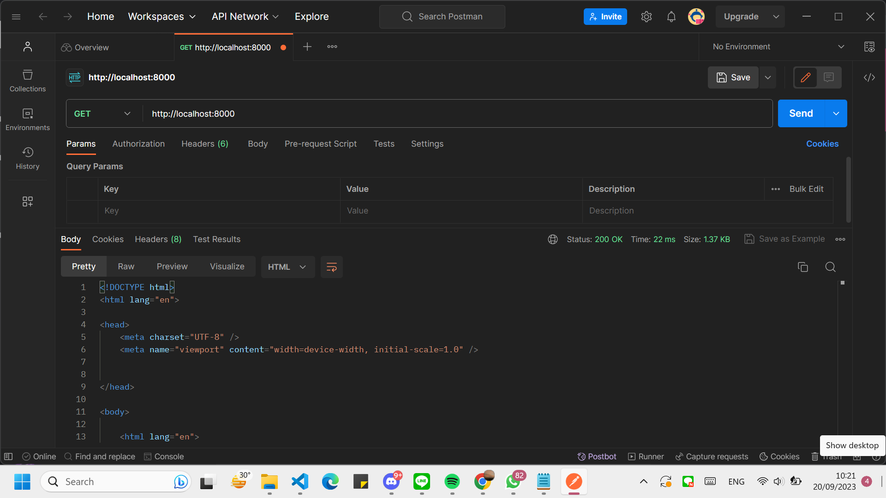
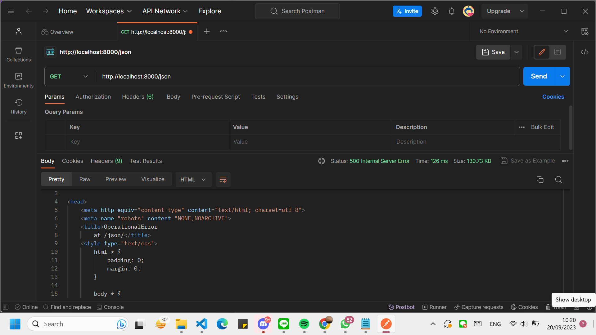
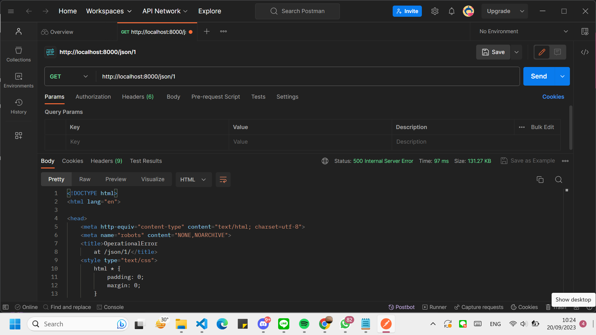
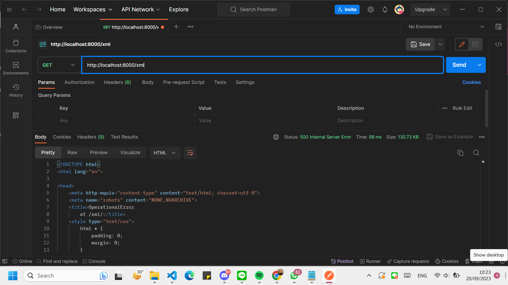

# tugas4-PBP 
Nama  : Clara Sista Widhiastuti <br/>
NPM   : 2206825782 <br/>
Kelas : PBP-E <br/>


## Pengertian Django UserCreationForm, dan kelebihan dan kekurangannya
### Pengertian
Django ```UserCreationForm``` adalah ```form``` yang disediakan oleh Django agar mempermudah dalam pembuatan pengguna baru pada aplikasi web. Form ini memiliki tiga bagian ```username```, ```password1```, dan ```password2``` (yang digunakan untuk menkonfirmasi kata sandi).

### Kelebihan dan kekurangan
| **Kelebihan** | **Kekurangan**
|--|--|
memiliki validasi bawaan untuk memastikan sandi yang digunakan oleh pengguna | tidak mendukung penyesuaian lebih lanjut atau desain yang lebih kompleks
mudah untuk digunakan | Tidak cocok pada aplikasi yang memerlukan autentikasi pengguna
dapat menyesuaikan ```UserCreationForm``` sesuai dengan kebutuhan kita, meskipun merupakan formulir bawaan

## Perbedaan autentikasi dan otorisasi, Mengapa keduanya penting
### Perbedaan
| ```Autentikasi``` | ```Otorisasi```
|--|--|
| Proses verifikasi identitas seseorang dalam sistem sebelum memberikan akses ke sistem. Memastikan bahwa identitas pengguna adalah identitas yang mereka katakan/gunakan. | Mevalidasi daftar akses pengguna yang telah di autentikasi sebelumnya. Kemudian membatasi akses-akses kepada layanan tertentu pada sistem.

### Mengapa penting
Untuk keamanan data dan mencegah penyalahgunaan, bahwa data pengguna akan di autentikasi kevalidannya dimana pengguna di verifikasi untuk memastikan bahwa mereka merupakan orang yang mereka katakan. Kemudian di otorisasi melakukan pengedalian akses bagi pengguna yang telah ter autentikasi sebelumnya.

## Cookies dalam konteks aplikasi web (Django)
Cookies adalah kumpulan informasi terkait rekam jejak dan aktivitas ketika pengguna menelusuri sebuah website. Cookies ini dapat menunjukkan berbagai aktivitas dari user yang dilakukan sebelumnya, misalnya masuk ke halaman yang dibuka.
Pada Django, cookies digunakan untuk mengelola data secara aman. Django menyediakan framework session yang memungkinkan untuk mengambil dan menyimpan data sesi pada baris pengunjung situs. 

## Penggunaan cookies secara default
Penggunaan cookies secara default dianggap aman-aman saja namun ada beberapa resiko yang perlu diperhatikan.
1. **Pelacakan pengguna:** cookies dapat digunakan untuk melacak aktivitas pengguna di web tersebut.
2. **keamanan dan privasi:** cookies berisi informasi pribadi dari pengguna, jika cookies diretas maka informasi pribadi dari pengguna akan terancam.
3. **Ketergantungan terhadap web:** Beberapa web ada yang tidak dapat berfungsi dengan baik jika cookies di nonaktifkan.

## Implementasi Autentikasi, Session, dan Cookies pada Django

### Membuat Fungsi dan Form Registrasi
Buka berkas ```views.py``` pada ```main``` kemudian mengimport beberapa modul serta membuat fungsi dengan nama ```register```.
```
from django.shortcuts import redirect
from django.contrib.auth.forms import UserCreationForm
from django.contrib import messages 

...

def register(request):
    form = UserCreationForm()

    if request.method == "POST":
        form = UserCreationForm(request.POST)
        if form.is_valid():
            form.save()
            messages.success(request, 'Your account has been successfully created!')
            return redirect('main:login')
    context = {'form':form}
    return render(request, 'register.html', context)
```
Buat berkas baru ```register.html``` pada ```main/templates``` dan isi dengan kode berikut.
```



    <title>Register</title>


  

<div class = "login">
    
    <h1>Register</h1>  

        <form method="POST" >  
              
            <table>  
                {{ form.as_table }}  
                <tr>  
                    <td></td>
                    <td><input type="submit" name="submit" value="Daftar"/></td>  
                </tr>  
            </table>  
        </form>

      
        <ul>   
              
                <li>{{ message }}</li>  
                  
        </ul>   
    

</div>  


```
### Membuat fungsi login dan Merestriksi Akses Halaman Main
Pada berkas ```views.py``` di ```main``` mengimpor beberapa modul dan membuat fungsi ```login_user```

Kemudian menambahkan ```@login_required(login_url='/login')``` diatas fungsi ```show_main```
```
...
from django.contrib.auth import authenticate, login
from django.contrib.auth.decorators import login_required
...
@login_required(login_url='/login')
def show_main(request):
...
def login_user(request):
    if request.method == 'POST':
        username = request.POST.get('username')
        password = request.POST.get('password')
        user = authenticate(request, username=username, password=password)
        if user is not None:
            login(request, user)
            return redirect('main:show_main')
        else:
            messages.info(request, 'Sorry, incorrect username or password. Please try again.')
    context = {}
    return render(request, 'login.html', context)
```
Membuat berkas baru ```login.html``` pada folder ```main/templates```
```



    <title>Login</title>




<div class = "login">

    <h1>Login</h1>

    <form method="POST" action="">
        
        <table>
            <tr>
                <td>Username: </td>
                <td><input type="text" name="username" placeholder="Username" class="form-control"></td>
            </tr>
                    
            <tr>
                <td>Password: </td>
                <td><input type="password" name="password" placeholder="Password" class="form-control"></td>
            </tr>

            <tr>
                <td></td>
                <td><input class="btn login_btn" type="submit" value="Login"></td>
            </tr>
        </table>
    </form>

    
        <ul>
            
                <li>{{ message }}</li>
            
        </ul>
         
        
    Don't have an account yet? <a href="">Register Now</a>

</div>


```
### Membuat fungsi logout
Buka berkas ```views.py``` pada ```main``` import module yang diperlukan dan membuat fungsi ```logout_user```

```
...
from django.contrib.auth import logout
...
def logout_user(request):
    logout(request)
    return redirect('main:login')
```
Buka berkas ```main.html``` pada folder ```main/templates``` kemudian tambahkan kode berikut
```
...
<a href="">
    <button>
        Logout
    </button>
</a>
...
```
### Urls dan UrlPatterns
impor fungsi yang telah di buat tadi ke berkas ```urls.py``` yang ada di ```main``` dan menambahkan path ke ```urlpatterns```
```
...
from main.views import register
from main.views import login_user
from main.views import logout_user
...

urlpatterns = [
    ...
    path('register/', register, name='register'),
    path('login/', login_user, name='login'),
    path('logout/', logout_user, name='logout'),
    ...
]
```
### Menghubungkan Item dan User
Buka berkas ```models.py``` pada ```main``` impor model
```
...
from django.contrib.auth.models import User

class Product(models.Model):
    user = models.ForeignKey(User, on_delete=models.CASCADE)
    ...
```
Pada berkas ```views.py``` di ```main``` ubah fungsi ```create_item``` dan fungsi ```show_main```
```
def show_main(request):
    items = Item.objects.filter(user=request.user)

    context = {
        'name': request.user.username,
    ...
...
def create_product(request):
 form = ItemmForm(request.POST or None)

 if form.is_valid() and request.method == "POST":
     item = form.save(commit=False)
     item.user = request.user
     item.save()
     return HttpResponseRedirect(reverse('main:show_main'))
 ...
```
Terakhir, simpan semua perubahan dan lakukan migrasi model

### Menggunakan Data Dari Cookies
Buka berkas ```views.py``` pada ```main``` kemudian impor modul yang diperlukan, mengganti kode pada blok ```if user not None```, menambahkan ```'last_login``` pada fungsi ```show_main```, dan mengubah fungsi ```logout_user```
```
import datetime
...
    context = {
        'name': request.user.username,
        'class': 'PBP-E',
        'product': products,
        'last_login': request.COOKIES['last_login'],
        }
...
    if user is not None:
        login(request, user)
        response = HttpResponseRedirect(reverse("main:show_main"))
        response.set_cookie('last_login', str(datetime.datetime.now()))
        return response
...
def logout_user(request):
    logout(request)
    response = HttpResponseRedirect(reverse('main:login'))
    response.delete_cookie('last_login')
    return response
```
Menambahkan kode berikut pada berkas ```main.html``` pada folde ```main/templates```
```
...
<h5>Sesi terakhir login: {{ last_login }}</h5>
...
```

<details>
<summary> <b> Tugas 3 </b> </summary>

## Perbedaan form POST dan form GET

| **Pembeda** | ```POST``` | ```GET``` |
|:--:|--|--|
|**Fungsi**|Mengirimkan data ke server|Mengambil data dari server|
|**History**|Isi atau nilai dari form tidak ditampilkan di URL|Isi atau nilai dari form dapat dilihat langsung pada URL
|**Kegunaan**|Pengiriman data tertutup dan data bersifat sensitif (*username* dan *password*)|Menampilkan id pada penggunaan database

## Perbedaan XML, JSON, HTML dalam pengiriman data
| ```XML``` | ```JSON``` |```HTML```
|--|--|--|
|Didesain untuk mendeskripsikan serta mentransfer data. Data harus berupa string dan tidak mendukung array|Didesain untuk mendeskripsikan serta mentransfer data menggunakan bahasa yang mudah dimengerti. Dapat mengakses array.|Didesain untuk menampilkan data dan bagaimana penampakan data tersebut.|
|case sensitive|case sensitive|case nsensitive
|Menggunakan tag|Menggunakan pasangan key dan value|Menggunakan tag|

## JSON sering digunakan dalam pertukaran data antara aplikasi web modern
Alasan JSON sering digunakan untuk pertukaran data adalah:
1.  Ukuran file JSON lebih kecil dibanding format lain seperti XML
2. JSON memiliki struktur kode yang sederhana sehingga mudah dibaca serta dimengerti oleh manusia.
3. Dapat digunakan dengan berbagai jenis bahasa, Hal tersebut membuatnya menjadi lebih fleksible. 

## Implementasi data delivery
1. Membuat berkas baru dengan nama ```forms.py``` pada direktori ```main``` kemudian tambahkan kode dibawah ini
```
from django.forms import ModelForm
from main.models import Product

class ProductForm(ModelForm):
    class Meta:
        model = Product
        fields = ["name", "amount", "description"]
```
2. pada folder ```main``` buka berkas ```views.py``` tambahkan import dan fungsi baru create_ product untuk menerim data seperti berikut
```
from django.http import HttpResponseRedirect
from main.forms import ProductForm
from django.urls import reverse
```
```
def create_product(request):
    form = ProductForm(request.POST or None)

    if form.is_valid() and request.method == "POST":
        form.save()
        return HttpResponseRedirect(reverse('main:show_main'))

    context = {'form': form}
    return render(request, "create_product.html", context)
```
3. Agar kita dapat menampilkan/mengembalikan data maka perlu mengubah fungsi ```show_main``` pada berkas ```views.py``` seperti kode dibawah ini
```
def show_main(request):
    products = Product.objects.all()

    context = {
        'name': 'Clara Sista Widhiastuti', 
        'class': 'PBP E', 
        'products': products
    }

    return render(request, "main.html", context)
```
4. Buka direktori ```main/templates```, kemudian buat berkas baru dengan nama ```create_product.html``` isi dengan kode dibawah ini
```
 


<h1>Add New Product</h1>

<form method="POST">
    
    <table>
        {{ form.as_table }}
        <tr>
            <td></td>
            <td>
                <input type="submit" value="Add Product"/>
            </td>
        </tr>
    </table>
</form>


```
5. menampilkan ```data``` ke dalam bentuk table dan menambahkan tombol ```Add New Product``` dengan menambahkan kode berikut pada berkas ```main.html```
```
...
<table>
    <tr>
        <th>Name</th>
        <th>Price</th>
        <th>Description</th>
        <th>Date Added</th>
    </tr>

     Berikut cara memperlihatkan data produk di bawah baris ini 

    
        <tr>
            <td>{{product.name}}</td>
            <td>{{product.price}}</td>
            <td>{{product.description}}</td>
            <td>{{product.date_added}}</td>
        </tr>
    
</table>

<br />

<a href="">
    <button>
        Add New Product
    </button>
</a>


```
---
membuat fungsi views JSON dan XML pada berkas ```views.py``` di direktori ```main```
1. menambahkan import ```HttpResponse``` dan ```Serializer```
```
from django.http import HttpResponse
from django.core import serializers
```
2. membuat variabel yang dapat menyimpan hasil query dari semua data dalam masing masing fungsi 
```
def show_xml(request):
    data = Product.objects.all()
    return HttpResponse(serializers.serialize("xml", data), content_type="application/xml")

def show_json(request):
    data = Product.objects.all()
    return HttpResponse(serializers.serialize("json", data), content_type="application/json")
```
3. Untuk mengembalikan data berdasarkan ID dalam bentuk XML dan JSON maka kita perlu membuat fungsi ```show_xml_id``` dan ```show_json_by_id```
```
def show_xml_by_id(request, id):
    data = Product.objects.filter(pk=id)
    return HttpResponse(serializers.serialize("xml", data), content_type="application/xml")
def show_json_by_id(request, id):
    data = Product.objects.filter(pk=id)
    return HttpResponse(serializers.serialize("json", data), content_type="application/json")
```
---
Routing URL
1. pada direktori ```main``` buka berkas ```urls.py``` tambahkan import fungsi XML dan JSON
```
from main.views import show_main, create_product, show_xml, show_json, show_xml_by_id, show_json_by_id 
```
2. Tambahkan path url ke dalam ```urlpatterns```
```
...
urlpatterns = [
    path('', show_main, name='show_main'),
    path('create-product', create_product, name='create_product'),
    path('xml/', show_xml, name='show_xml'),
    path('json/', show_json, name='show_json'), 
    path('xml/<int:id>/', show_xml_by_id, name='show_xml_by_id'),
    path('json/<int:id>/', show_json_by_id, name='show_json_by_id'),
]
```
## Screenshot Postman
#### HTML

#### JSON

#### JSON_ID

#### XML

#### XML_ID

</details>

<details>
<summary> <b> Tugas 2 </b> </summary>
## Proses pembuatan app django
1. Membuat Direktori Repository<br/>
   Membuat direktori baru yaitu **tugas_PBP**, kemudian pada github membuat repository baru yang judulnya sama dengan direktori
   
2. Mengaktifkan virtual evironment<br/>
   Pengaktifan virtual evironment dilakukan agar package yang digunakan tetap terisolasi sehingga bertabarakan dengan pengaturan lainnya. <br/> Kita perlu membuat virtual         environment dengan menjalankan perintah ```python -m venv env```,<br/>kemudian diaktifkan dengan menjalankan perintah ```env\Scripts\activate.bat```. Menambahkan modul yang yang diperlukan pada file ```requirenments.txt```<br/> kemudian menjalankan perintah ```pip install -r requirements.txt```

3. Membuat proyek django<br/>
   buat proyek djago dengan menjalankan perintah ```django-admin startproject tugas_PBP .```<br/> Tambahkan ```*``` pada ```ALLOWED_HOST``` di ```settings.py``` digunakan agar semua host dapat mengakses sehingga aplikasi dapat diakses luas.<br/> Pada windows untuk menjalankan server django dapat menggunakan python ```manage.py runserver```<br/>

4. Mengunggah proyek ke github<br/>
   membuat direktori menjadi repositori git, dengan cara menjalankan perintah ```git init```, kemudian ```git branch -M main```, dan ```git remote add origin https://github.com/claraa26/tugas-PBP.git```<br/>
   menambahkan file ```.gitignore```<br/>
   jangan lupa melakukan ```add```, ```commit```, dan ```push```

5. Membuat aplikasi (main) <br/>
   untuk membuat aplikasi maka perlu menjalankan perintah ```python manage.py startapp main```<br/>
   mendaftarkan aplikasi (main) pada proyek, dengan menambahkan aplikasi pada bagian ```INSTALLED_APPS``` di file ```settings.py```<br/>

6. Membuat templates dasar <br/>
   Membuat file main.html pada direktori templates yang berada di dalam direktori aplikasi (main) yang berisi
   ```
   <h1>Bimble-Online Page</h1>
   
   <h5>Name: </h5>
   <p>{{ name }}</p>
   <h5>Class: </h5>
   <p>{{ class }}</p>
   <h5>Slot Available: </h5>
   <p>{{ slot available }}</p>
   <h5>Description: </h5>
   <p>{{ description }}</p>
   ```
   Membuat ```models.py``` kemudian melakukan migrasi. Hal tersebut merupakan cara django melacak perubahan pada model basis data. 
   untuk dapat membuat migrasi model perlu dijalankan perintah ```python manage.py makemigrations```<br/>
   Kemudian menerapkan migrasi model dengan perintah ```python manage.py migrate```

7. Membuat fungsi view (show_main)<br/>
   Dilakukan perintah ```from django.shortcuts import render``` agar yang berada pada file template ```main.html``` dapat terhubuh pada view.<br/>
   Menambahkan fungsi show main dengan context yang ingin ditampilkan
```
from django.shortcuts import render

def show_main(request):
    context = {
        'name': 'Clara',
        'class': 'math',
        'slot available': '15',
        'description': 'math class available for 15 person'

    }

    return render(request, "main.html", context)
```

8. Konfigurasi routing urls<br/>
   file urls.py pada main berisi
   ```
   from django.urls import path
   from main.views import show_main

   app_name = 'main'

   urlpatterns = [
      path('', show_main, name='show_main'),
   ]
   ```
   show main diambil dari modul main.views yang mana merupakan tampilan ketika urls diakses<br/>
   menghubungkan urls.py proyek dengan main dengan menambahkan
```
   urlpatterns = [
    ...
    path('main/', include('main.urls')),
    ...
]
```
  jalankan proyek django dengan perintah ```python manage.py runserver```

## Bagan Request Client
.png)

## Penggunaan Virtual Environment Pada Django
Pada djanggo penggunaan virtual environment sangatlah berguna, karena pengguna dapat menggunakan django dengan dependencies tertentu secara lokal tanpa mempengaruhi instalasi globalnya. Selain itu, dalam jangka panjang penggunaan virtual environment dapat mepermudah pengembangan apliaksi web django. Tentu saja kita dapat menggunkan django tanpa virtual environment, namun hal tersebut tidak dianjurkan karena dapat menyebabkan masalah pada package dan dependencies

## Perbedaan MVC, MVT, MVVM
### MVC (Model-View-Controller)
  Model berisikan data serta logika (database)<br/>
  View berguna untuk menangani tampilan <br/>
  Controler menghubungkan antara model dan view <br/>
### MVT (Model-View-Template)
  Model merupakan komponen yang bertanggungjawab dalam mengatur dan mengola data aplikasi<br/>
  View komponen yang menangani logika presentasi dalam konsep MVT<br/>
  Template merupakan komponen yang berfungsi untuk mengatur tampilan pengguna<br/>
### MVVM (Model-View-ViewModel)
  Model berisi data dan logika bisnis<br/>
  View menangani tampilan<br/>
  ViewModel merupakan penghubung antara model dan view<br/>
Perbedaan dari ketinganya adalah bagaimana cara menghubungkan antar komponen. Pada MVC, controller berperan sebagai penghubung model dan view. Pada MVT, template berperan sebagai penghubung model dan view. Sedangkan pada MVVM, ViewModel yang berperan sebagai penghubung antara model dan view.

